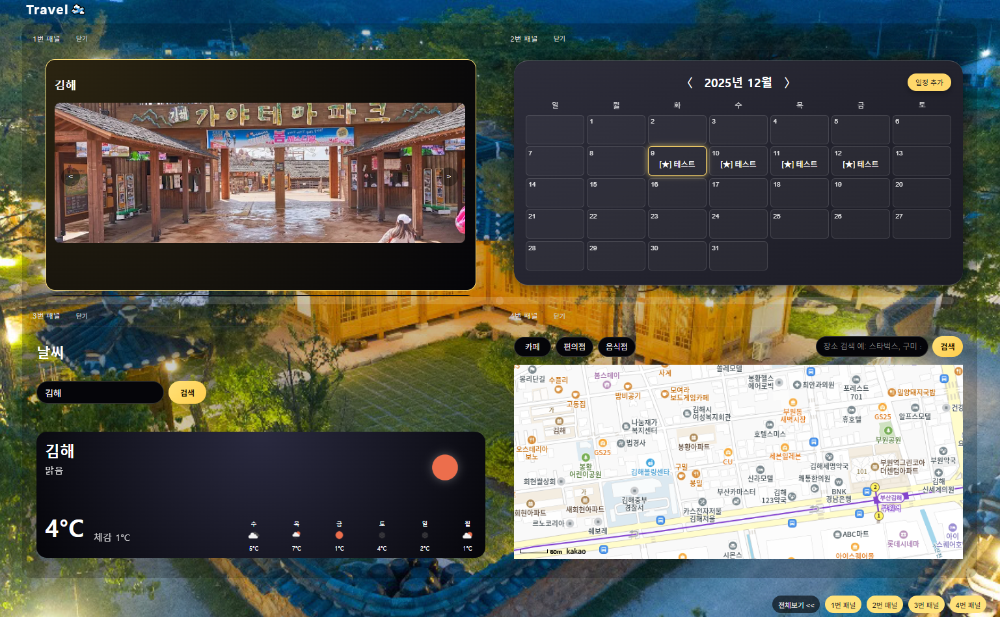

# TripPanel

여행 일정, 날씨, 지도 정보를 하나의 화면에서 확인할 수 있는 리액트 기반 여행 대시보드 웹 서비스입니다.

## 적용 기술

- JavaScript (ES6+)
- React (Vite) / JSX
- React Router
- Axios (HTTP 요청)
- OpenWeather API
- Kakao Map API
- CSS
- Git

## 주요 기능

- 지역별 여행 정보 조회
- 실시간 날씨 연동
- 지도 기반 위치 확인
- 일정 관리 패널 제공

- 
